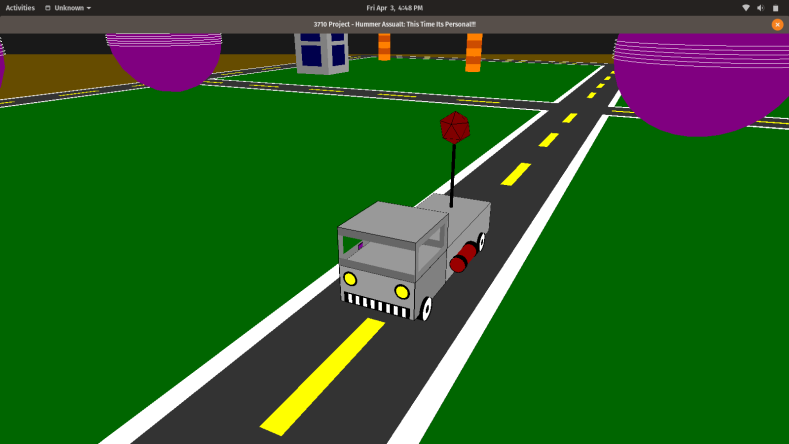

# opengl-course-project

This is the final project for my graphics class. It uses openGL to display a truck in a kind of city that you can drive around. It was supposed to be a group project, but when I was playing with it to see what I could do I ended up just finishing it in a few days anyway (the group didn't mind lol). The original instructions also included the ability to click on buildings and destroy them, but this was dropped due to the semester being cut short by the start of the pandemic.

The result is not exactly a smooth 3D rendering, but for a few days work with minimal knowledge of openGL it came together pretty nice. We got a 99% grade, lost a percent for using a builtin PI constant that the prof didn't have locally. There is a little more information on the project in the project summary pdf.

